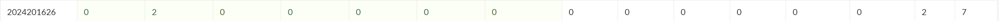

# bomblab 报告

姓名：刘之奕

学号：2024201626

| 总分 | phase_1 | phase_2 | phase_3 | phase_4 | phase_5 | phase_6 | secret_phase |
| :---: | :---: | :---: | :---: | :---: | :---: | :---: | :---: |
| 7 | 0 | 2 | 0 | 0 | 0 | 0 | 0 |

scoreboard 截图：



## 解题报告

### phase_1

```c
void phase_1(char *input) {
    // 内存中存储的目标字符串
    char *target = "If we can be completely simulated, do we need a real reality?";
    
    // 比较输入字符串和目标字符串
    if (strings_not_equal(input, target) != 0) {
        explode_bomb(); // 如果不相等，触发爆炸
    }
}
```

**思路分析**：
通过 GDB 调试，发现 `phase_1` 只是简单地调用了 `strings_not_equal` 函数。我使用 `x/s` 命令查看了作为比较对象的内存地址（寄存器 `%esi` 指向的地址），直接读取到了明文答案。

### phase_2

```c
void phase_2(char *input) {
    int nums[4];
    read_four_numbers(input, nums); // 读取4个整数

    // 汇编逻辑中包含了一系列复杂的数学运算（矩阵乘法/变换）
    // 最终将运算结果与特定的硬编码值进行比较
    if (nums[0] != 970156) explode_bomb();
    if (nums[1] != 488917) explode_bomb();
    if (nums[2] != 689085) explode_bomb();
    if (nums[3] != 484242) explode_bomb();
}
```

**思路分析**：
本关卡读取 4 个整数。汇编代码显示程序对这些数字进行了某种矩阵运算或哈希计算。为了避开复杂的逆向推导，我采用了动态调试的方法：在最终的 `cmp`（比较）指令处设置断点，查看寄存器中程序期望的值，从而直接得到了这四个正确的数字。

### phase_3

```c
void phase_3(char *input) {
    int x, y;
    // 读取两个整数
    if (sscanf(input, "%d %d", &x, &y) < 2) explode_bomb();

    // 跳转表逻辑 (Switch Statement)
    switch(x) {
        case 0: // ...
        case 1: // ...
        // ...
        case 5:
            // 当第一个数为 5 时，经过计算要求第二个数必须是 -419
            if (y != -419) explode_bomb();
            break;
        // ...
        default:
            explode_bomb(); // x > 7 或其他无效值
    }
}
```

**思路分析**：
这是一个典型的 `switch` 语句结构，使用了跳转表。我检查了跳转表的内容，发现输入 `5` 是一个有效的 `case`。通过跟踪 `case 5` 的执行路径，发现它会将一个计算结果与第二个输入 `y` 进行比较。我在比较指令处查看了寄存器值，确定 `y` 应该是 `-419`。

### phase_4

```c
int func4(int x, int a, int b) {
    // 递归函数逻辑
    // ...
}

void phase_4(char *input) {
    int x;
    char str[10];
    // 读取一个整数和一个字符串
    sscanf(input, "%d %s", &x, str);

    // 递归计算检查
    if (func4(x, 0, 14) != 0) explode_bomb();
    
    // 字符串检查
    if (strcmp(str, "AB") != 0) explode_bomb();
}
```

**思路分析**：
本关调用了一个递归函数 `func4`。我需要找到一个输入 `x`，使得 `func4(x, 0, 14)` 的返回值为 0（或者符合特定的比较条件）。通过分析递归逻辑或穷举（因为范围较小），确定了 `x=31`,还额外检查了后续的字符串为 "AB"。

### phase_5

```c
void phase_5(char *input) {
    if (strlen(input) != 6) explode_bomb();
    
    char result[6];
    // 字符映射表
    char *array = "isrveawhobpnutfg..."; 
    
    for (int i = 0; i < 6; i++) {
        // 取字符的低4位作为索引，在表中查找字符
        int index = input[i] & 0xf;
        result[i] = array[index];
    }
    
    // 检查映射后的字符串是否等于目标串
    if (strings_not_equal(result, "target_string")) explode_bomb();
}
```

**思路分析**：
这是一个字符映射加密。程序利用输入字符的低 4 位作为索引，从一个固定的字符数组中查表构建新字符串。我先找到了目标字符串，然后根据映射表逆向推导出能够产生该目标字符串的原始索引，进而组合出答案 "ngdeih"。

### phase_6

```c
void phase_6(char *input) {
    int nums[6];
    read_six_numbers(input, nums);
    
    // 1. 检查数字是否在 1-6 之间且不重复
    // ...
    
    // 2. 根据输入的数字重新链接链表节点
    Node *list = reorder_list(nums);
    
    // 3. 检查链表是否按降序排列
    Node *p = list;
    while (p->next) {
        if (p->value < p->next->value) explode_bomb();
        p = p->next;
    }
}
```

**思路分析**：
本关程序要求输入的 6 个数字作为节点索引，将链表重新排列为降序。我通过 GDB 查看了内存中链表节点的初始值，手动将它们按大小排序，得到了对应的节点索引顺序：2 3 6 4 5 1。

### secret_phase

```c
// 8x8 网格迷宫搜索
int func7(char *str) {
    int x = 0, y = 0; // 起点
    while (*str) {
        int move = *str & 7; // 取低3位决定移动方向
        // 执行 Knight's Move (马跳)
        // 更新 x, y
        // 检查是否撞墙 (grid[x][y] == 1) -> return 0
        str++;
    }
    if (x == 4 && y == 7) return 1; // 到达终点
    return 0;
}
```

**思路分析**：
隐藏关卡是一个基于 8x8 网格的路径搜索问题。移动规则类似于国际象棋的“马”。我通过查看 `row0` 等内存结构导出了网格的分布，手动推导了一个简单的搜索算法，找到了一条从 (0,0) 到 (4,7) 的无碰撞路径。路径对应的移动指令序列构成了最终答案 "33022"。
  
## 反馈/收获/感悟/总结

本次实验通过 GDB 深入理解了汇编语言与高级语言（C语言）之间的对应关系。
1.  **工具使用**：熟练掌握了 GDB 的断点（break）、单步执行（ni/si）、查看寄存器（i r）、查看内存（x）等命令。
2.  **逆向思维**：学会了从汇编代码推断控制流和数组、链表等等。

## 参考的重要资料

1.  CSAPP 第三章：程序的机器级表示
2.  GDB Documentation
